<div align="center">

# 🌊 DevFlow
### The Engineering AI Orchestrator for AkitaLLM

[](https://fastapi.tiangolo.com)
[](https://reactjs.org)
[](https://expo.dev)
[](https://sqlite.org)
[](https://pypi.org/project/akitallm/)

<p align="center">
  <strong>Orchestrate. Analyze. Execute.</strong><br>
  DevFlow is a visual platform that turns the <em>AkitaLLM</em> command-line utility into a powerhouse for local-first software engineering.
</p>

</div>

---

## 🚀 About The Project

**DevFlow** removes the "black box" abstraction from AI coding tools. Instead of just chatting, you build structured pipelines where AI Agents (powered by AkitaLLM) analyze your code, plan features, and solve bugs directly in your local environment.

### ✨ Key Features

-   **🔍 Structural Code Review**: Detect architectural risks and bugs using AST analysis.
-   **📝 Technical Planning**: Generate comprehensive implementation plans before writing code.
-   **🛠️ Bug Solving Agents**: Autonomous agents that read errors and propose fixes.
-   **🎨 Premium UI/UX**: Modern glassmorphism web interface and a stunning **Dark Mode** mobile app.
-   **📱 Mobile Orchestration**: CRUD operations for projects and execution triggers directly from your phone.
-   **🔒 Local-First Security**: Your code stays on your machine. Database is local SQLite.

---

## 🏗️ Architecture

DevFlow is strictly separated into a robust service-oriented architecture:

```mermaid
graph TD
    User[👩‍💻 User] -->|React UI| Frontend[⚛️ DevFlow Frontend]
    Frontend -->|REST API| Backend[🐍 FastAPI Backend]
    
    subgraph Core System
        Backend -->|Auth| Security[🔐 Argon2 Security]
        Backend -->|Data| DB[(🗄️ SQLite + Async)]
        Backend -->|Orchestration| AkitaEngine[🐕 AkitaLLM Wrapper]
    end
    
    AkitaEngine -->|CLI| Subprocess[💻 Akita CLI]
    Subprocess -->|Scan| LocalFiles[📂 User Project Files]
    
    Backend -.->|JSON API| Mobile[📱 React Native Mobile]
```



---

## 📱 Mobile Companion (Expo)

DevFlow includes a mobile app for monitoring your agents on the go.

### Features
-   **Push Notifications**: Get alerted when a long-running plan completes.
-   **Live Logs**: Watch the terminal output from your phone.
-   **Quick Actions**: Cancel or Restart pipelines remotely.

> **Note**: The mobile module location is `/mobile` and requires Expo Go to run.

---

## ⚡ Getting Started

### Prerequisites

| Component | Requirement | Description |
|-----------|-------------|-------------|
| **Python**| `3.10+` | For the Backend engine. |
| **Node.js** | `18+` | For the React Frontend. |
| **AkitaLLM**| `pip install akitallm` | The core intelligence engine. |

### 📥 1. Clone & Setup Backend

```bash
cd backend

# Create virtual environment
python -m venv venv
source venv/bin/activate  # Windows: venv\Scripts\activate

# Install dependencies
pip install -r requirements.txt

# Run the server
uvicorn app.main:app --reload
```
*Backend will run at: `http://127.0.0.1:8000`*

### 🎨 2. Setup Web Frontend

```bash
cd frontend

# Install dependencies
npm install

# Start development server
npm run dev
```
*Frontend will run at: `http://localhost:5173`*

### 📱 3. Setup Mobile App (Expo)

```bash
cd mobile

# Install dependencies
npm install

# Start Expo (Metro Bundler)
npx expo start
```
*Scan the QR Code with **Expo Go** (Android) or **Camera** (iOS).*

> [!IMPORTANT]
> To connect the mobile app to the backend, make sure your phone and PC are on the **same Wi-Fi** and run the backend with:  
> `uvicorn app.main:app --reload --host 0.0.0.0`

---

## 🎮 How to Use

### 1️⃣ Create a Project
Go to the **"Projetos"** tab and click `+ Novo Projeto`. Give it a name and description.

### 2️⃣ Configure Execution
Click the `▶ Executar` button on a project card. A modal will appear:
-   **Review**: Enter a file path (e.g., `src/`) for a code review.
-   **Plan**: Enter a feature request (e.g., "Add JWT Auth").
-   **Solve**: Enter a bug description.

### 3️⃣ Monitor Agents
Switch to the **"Execuções"** tab. You'll see real-time logs as the AkitaLLM engine analyzes your files and executes the task.

### 4️⃣ Build Plugins
Need a new tool? Use the **"Plugin Builder"** in the menu to visually create tools and copy the generated Python code to extend your agent's capabilities.

---

## 🛠️ Tech Stack Details

*   **Backend**: FastAPI, SQLAlchemy (Async), Uvicorn.
*   **Security**: JWT Authentication, Argon2 Password Hashing.
*   **Web**: React, Vite, CSS Modules.
*   **Mobile**: React Native, Expo, React Navigation (Tabs/Stack), Axios.
*   **Intelligence**: AkitaLLM Engine (Python wrapper).

---

## 🤝 Contributing

Contributions are what make the open source community such an amazing place to learn, inspire, and create. Any contributions you make are **greatly appreciated**.

1.  Fork the Project
2.  Create your Feature Branch (`git checkout -b feature/AmazingFeature`)
3.  Commit your Changes (`git commit -m 'Add some AmazingFeature'`)
4.  Push to the Branch (`git push origin feature/AmazingFeature`)
5.  Open a Pull Request

---

<div align="center">
  <small>Built with ❤️ by Kerubin . Powered by AkitaLLM.</small>
</div>
